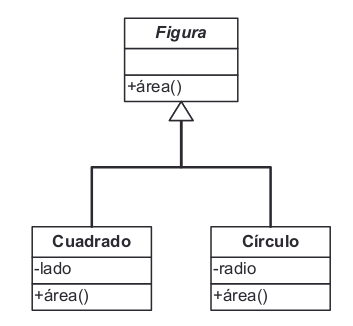

# Interfaz
Una interfaz es un tipo de abstracción que no contiene datos o código, pero sí
define comportamiento como firmas de métodos. Una clase puede implementar los
métodos definidos en la interfaz formando un subtipo de esa interfaz. Además una
clase puede implementar varias interfaces y llegar a ser de diferentes subtipos.

Por ejemplo:

```
interfaz Stack:
  Métodos:
    pop()
    push(val)

Lista implementa Stack:
  pop(){
    ...
  }
  push(val){
    ...
  }
```

Una interfaz es como una clase abstracta pero sin métodos concretos.


